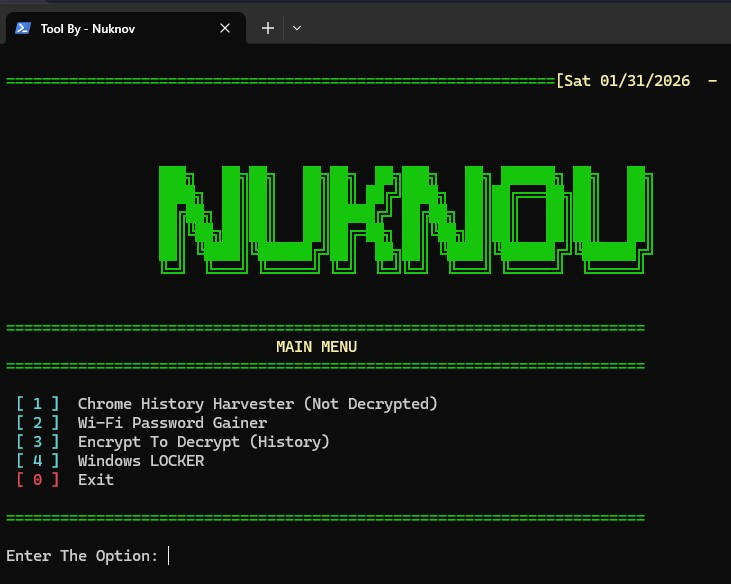

# **Chrome History Decrypter -- System Analysis Toolkit**

[]()
[](LICENSE)
[](https://github.com/Nuknov)
[](https://nuknov.github.io)

**Chrome History Decrypter** is a modular Windows toolkit developed for educational, red team, and digital forensics demonstrations.

It enables security enthusiasts to extract and analyze Chrome browsing history from local systems. Future versions aim to integrate simple decryption or data correlation techniques for more comprehensive investigations.

**Windows Only. Modular. Educational.**  
Built for **security researchers, digital forensics students, and red team professionals** who need system analysis capabilities in controlled environments.

---

## 📸 **Screenshot**



---

## 🧩 **What Chrome History Decrypter Does**

- Extracts **Chrome browsing history** from local database
- Retrieves **stored Wi-Fi passwords** from the system
- Implements **Windows startup persistence** mechanism
- Provides **interactive menu interface** for module selection
- Runs **entirely on Windows batch** with no external dependencies
- Designed for **authorized testing and forensics education**

Designed for **security research, forensics training, and red team simulations** in controlled lab environments.

> \* *This tool requires explicit permission before use. See disclaimer below.*

---

## 🛰️ **Tech Stack**

- **Windows Batch Script** – Native Windows automation
- **CMD.exe** – Pre-installed on all Windows systems
- **SQLite Database Access** – Chrome history extraction
- **Windows API Calls** – Wi-Fi credential retrieval
- **Startup Registry Modification** – Persistence mechanism

---

## ⚡ **Features**

| Feature                     | Details                                                     |
|----------------------------|-------------------------------------------------------------|
| History Extraction         | Retrieves Chrome browsing history from local database       |
| Wi-Fi Password Dumper      | Extracts stored Wi-Fi keys for situational awareness        |
| Windows Locker             | Implements startup persistence mechanism                    |
| Interactive Menu           | User-friendly module selection interface                    |
| No Dependencies            | Pure batch script, no additional software needed            |
| Modular Architecture       | Easily add or remove modules as needed                      |
| Lightweight                | Minimal footprint, runs on any Windows system               |

---

## 🛠️ Installation

### Quick Setup

1. **Clone the repository**
   ```bash
   git clone https://github.com/Nuknov/Chrome-History-Decrypter.git
   cd Chrome-History-Decrypter
   ```

2. **No external dependencies required**
   - The toolkit is written in batch scripts
   - Ensure you have appropriate **administrative rights** to execute certain modules

3. **Launch the toolkit**
   ```cmd
   Main.bat
   ```

4. **Follow the interactive menu**
   - Choose the desired module from the menu
   - Follow on-screen instructions for each module

---

## 📋 **Modules Overview**

### 1. **History Extraction**
- Retrieves Chrome browsing history from:
  - `%LOCALAPPDATA%\Google\Chrome\User Data\Default\History`
- Extracts URLs, visit timestamps, and frequency data
- Outputs to readable format for analysis

### 2. **Wi-Fi Password Extractor**
- Dumps stored Wi-Fi credentials from Windows
- Shows network SSIDs and corresponding passwords
- Useful for situational awareness in authorized testing

### 3. **Windows Locker (DANGEROUS)**
- **⚠️ CRITICAL WARNING:** This is a **highly disruptive** module for research purposes only
- Implements malicious startup persistence mechanism
- When activated (option 4 in menu), copies a script to Windows startup folder
- **On next reboot:** Prevents user login **regardless of password correctness**
- Creates a login loop that blocks system access completely
- **Recovery methods:**
  - Boot into **Safe Mode** and delete the startup script
  - Interrupt boot process and delete script before Windows loads
  - Use Windows Recovery Environment to remove the file
- **⚠️ ONLY USE in isolated VMs or lab systems with recovery plans ready**
- This module demonstrates persistence techniques used in real malware

---

## 📂 **Usage**

### Basic Usage

1. Navigate to the cloned directory
2. Launch the toolkit:
   ```cmd
   Main.bat
   ```
3. Select desired module from interactive menu
4. Follow on-screen prompts

### Example Workflow

```cmd
C:\> cd Chrome-History-Decrypter
C:\Chrome-History-Decrypter> Main.bat

[Interactive Menu Appears]
1. Extract Chrome History
2. Dump Wi-Fi Passwords
3. Exit
4. Windows Locker ⚠️ DANGEROUS

Select option: 1
[Chrome history extraction begins...]
```

**⚠️ Important Note on Option 4:**
- Option 4 (Windows Locker) is **intentionally dangerous**
- Only select this option if you **fully understand the consequences**
- Have a **recovery plan ready** before activation
- **Test only in isolated environments** (VMs recommended)

---

## ⚙️ How It Works

Chrome History Decrypter uses **native Windows batch scripting** to:

1. **Locate Chrome database** files in user's AppData
2. **Extract data** using Windows command-line utilities
3. **Retrieve Wi-Fi credentials** via netsh commands
4. **Modify startup registry** for persistence (Windows Locker module)
5. **Present data** in readable format for analysis

✅ **Runs entirely locally**  
✅ **No network activity**  
✅ **Fully open source**

---

## 🔧 **Requirements**

| Requirement | Details |
|------------|---------|
| Operating System | Windows 7/8/10/11 |
| Python Version | 3.12.2 or above (for future features, but it also have .exe file) |
| Permissions | Administrator rights for certain modules |
| Batch Interpreter | cmd.exe (pre-installed on Windows) |
| Chrome Browser | Must be installed for history extraction |

---

## ⚠️ **Disclaimer**

> **CRITICAL: This toolkit is for educational and authorized testing purposes ONLY.**
>
> - You **MUST** have **explicit permission** from the system owner before use
> - This tool is designed for **controlled lab environments** and **authorized forensics scenarios**
> - The author is **NOT responsible** for any misuse or unauthorized deployment
> - **The Windows Locker module can render systems completely inaccessible**
>
> **Detection Risk:**  
> - **Kaspersky antivirus can now detect this toolkit**
> - Other modern AV solutions may also flag this as potentially unwanted
> - The Windows Locker module will be detected as **malicious by most antivirus software**
> - Using this on unauthorized systems is **illegal and unethical**
>
> **Windows Locker Specific Risks:**
> - **WILL prevent system login** after next reboot
> - **WILL NOT check password validity** - blocks all login attempts
> - **Requires Safe Mode or recovery procedures** to regain access
> - Can cause **significant disruption and data access issues**
> - Designed to simulate **real-world ransomware/malware behavior**
>
> **Recommendations:**  
> - **Always operate within your own environments** or with explicit written permission
> - Test in **isolated lab networks** or virtual machines **ONLY**
> - Understand the implications of each module before execution
> - Have a **documented recovery plan** before using the Windows Locker module
> - **Never use on production systems, work computers, or unauthorized machines**
> - Keep detailed logs of all testing activities for compliance
>
> Always comply with applicable laws, ethical guidelines, and organizational policies.

---

## 🧠 **Use Cases**

- **Digital forensics training** in educational settings
- **Authorized security assessments** with proper documentation
- **Red team exercises** in controlled corporate environments
- **Personal security research** on your own systems
- **Browser artifact analysis** for forensics students
- **Wi-Fi security audits** of authorized networks
- **Malware persistence research** in isolated lab environments
- **Ransomware behavior simulation** for defensive training
- **Incident response drills** using Windows Locker as simulated attack
- **Security awareness demonstrations** (controlled environments only)

Ideal for **security researchers, malware analysts, and forensics students** who need hands-on experience with Windows artifacts and persistence mechanisms in authorized scenarios.

---

## 🛡️ **Security & Detection Notes**

### Antivirus Detection
- **Kaspersky:** Known to detect and flag this toolkit
- **Windows Defender:** May trigger behavioral detection
- **Other AV Solutions:** Likely to flag due to credential extraction

### Operational Security
- **Run in isolated environments** (VMs, air-gapped systems) **MANDATORY for Windows Locker**
- **Disable AV for testing** only in controlled lab settings
- **Document all testing activities** for compliance
- **Have rollback procedures** ready before deployment
- **Windows Locker Recovery Plan:**
  - Keep Windows installation media ready
  - Document Safe Mode access procedures
  - Test recovery in VM before any real deployment
  - Have alternative login methods prepared
  - Consider VM snapshots before activation

### Windows Locker Technical Details
- **Startup Location:** `%APPDATA%\Microsoft\Windows\Start Menu\Programs\Startup`
- **Persistence Method:** Copies malicious batch script to startup folder
- **Execution Timing:** Runs automatically on every user login attempt
- **Blocking Mechanism:** Creates login loop that ignores password validation
- **Detection Status:** Flagged as malicious by most modern AV solutions
- **Recovery Time:** 5-15 minutes depending on user's technical skill
- **Real-World Parallel:** Simulates ransomware/screen locker behavior

### Ethical Considerations
- This toolkit accesses sensitive user data
- Chrome history reveals browsing behavior and privacy information
- Wi-Fi passwords are confidential credentials
- **Windows Locker can completely block system access and cause severe disruption**
- **Always prioritize user privacy and obtain written consent**
- **Windows Locker demonstrates techniques used by malicious actors**
- Understanding these methods is crucial for defense, but misuse is unethical and illegal
- **Never deploy Windows Locker outside authorized research environments**

---

## **Future Development**

Planned features for upcoming versions:

- **Advanced Decryption:** Decrypt Chrome passwords and cookies
- **Multi-Browser Support:** Firefox, Edge, Opera extraction
- **Export Functionality:** JSON, CSV, HTML report generation
- **Timeline Analysis:** Correlate browsing history with system events
- **Remote Deployment:** Network-based toolkit delivery (authorized only)
- **GUI Interface:** Optional graphical user interface
- **Stealth Mode:** Reduced detection footprint for research
- **Chrome History Forensic:** It will flag the potential harming words or searchs in the history.

---

## 🤝 **Contributing**

Contributions are welcome for **educational improvements**:

1. Fork the repository
2. Create a feature branch (`git checkout -b feature/improvement`)
3. Commit your changes (`git commit -m 'Add improvement'`)
4. Push to the branch (`git push origin feature/improvement`)
5. Open a Pull Request

Please ensure all contributions are for **legitimate educational purposes** and include proper documentation.

---

## 🔗 **Links**

- **GitHub:** [github.com/Nuknov](https://github.com/Nuknov)
- **Twitter/X:** [@Nuknov](https://x.com/Nuknov)
- **Portfolio:** [nuknov.github.io](https://nuknov.github.io)
- **Report Issues:** [GitHub Issues](https://github.com/Nuknov/Chrome-History-Decrypter/issues)

---

## **Author**

**Created by:** [Nuknov](https://github.com/Nuknov)

**Remember:** Knowledge is power. Use it responsibly and ethically. 

---

## ⭐ **Support**

If you find this project useful for your security research or education, please consider:
- ⭐ **Starring** the repository
- 🐛 **Reporting bugs** via GitHub Issues
- 🤝 **Contributing** improvements and modules
- 📢 **Sharing** with the security research and forensics community
- 💬 **Providing feedback** on feature requests

---

*You laugh at skids, but sometimes they can break things you can't.*
